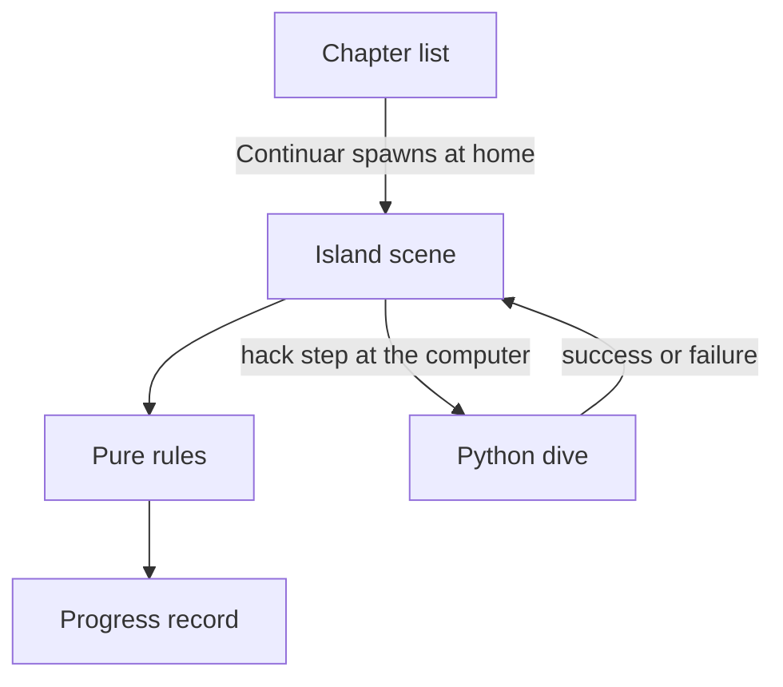
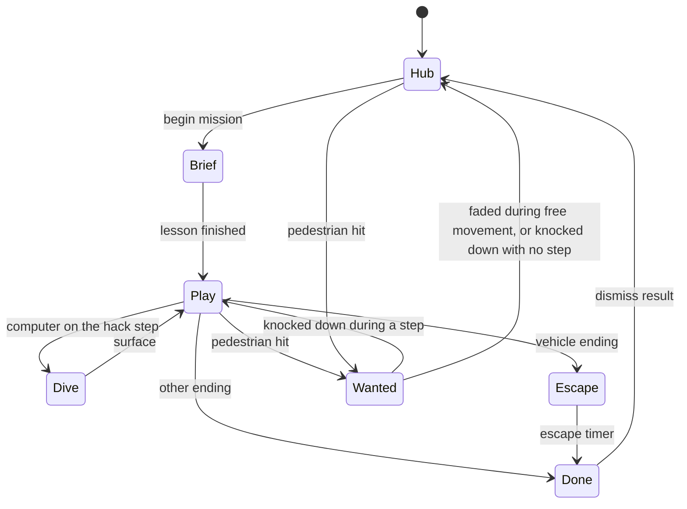
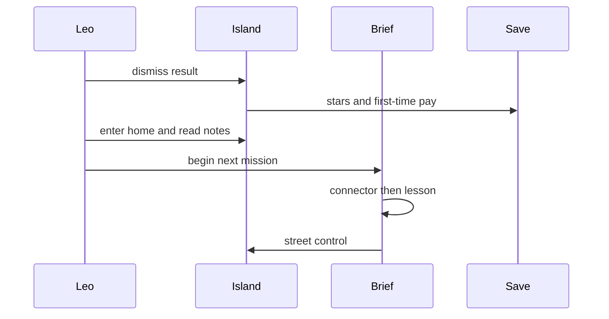

# Ilha persistente do Porto Seco - Plan

## Goal Capsule

- **Objective:** Turn Porto Seco into one island where Léo lives between missions, hacks a different system each time, and grows through money, a motorcycle, study at home, and a continuous story.
- **Authority:** Product Contract wins on behavior. Key Technical Decisions win on mechanism inside those requirements. An implementation unit overrides neither.
- **Execution profile:** Code change in the existing Next.js and Three.js game. Pure rules get node tests. The island is proven by playing it.
- **Stop conditions:** Stop if a change rewrites the Python lessons, adds background music, opens every street building, or stores position or wanted level in `porto-seco-progress-v1`.
- **Tail:** Update `README.md` so a local run describes the island loop. Leave Netlify and the lesson files alone.

---

## Product Contract

Product Contract authored in this plan from the confirmed scope. No upstream contract to preserve.

### Summary

The next playable Porto Seco is one island. Léo lives there between missions: he studies at home, earns money, and rides a motorcycle. Each mission changes place, objective, and ending. The escape car with Tio Rui is one possible ending, not the ending of every mission. He can enter his home, the hack target, and a few shops. Shooting a pedestrian calls the police. A short skippable scene ties one mission to the next, and the Python lesson still plays after it.

### Problem Frame

Every live mission ends by running to Tio Rui's car. The city is a new neighborhood on every level, so home, money, and a bike have nowhere to persist. Pedestrians only flee when shot near them. The story resets its place each time the next level loads.

### Actors

- A1. Léo, the player.
- A2. Pedestrians on the street.
- A3. Police who pursue after a pedestrian is hit.
- A4. Dani and the other allies.
- A5. Tio Rui, present on vehicle endings.

### Requirements

**Island**

- R1. The playable city is one island, and that same map remains between missions.
- R2. The sea is the boundary. Touching it knocks Léo down and returns him to the last checkpoint.
- R3. The existing chapter looks become fixed districts on that island. Each mission uses places in its chapter district.

**Missions**

- R4. Consecutive missions differ in place, objective, and ending.
- R5. The car escape with Tio Rui is not the ending of every mission.
- R6. Chase missions and boss confrontations may still end by reaching a vehicle.
- R7. Every other mission ending records stars and unlocks the next level without the vehicle cinematic.

**Places and study**

- R8. The only enterable places are Léo's home, the current hack target, and a few shops.
- R9. Inside a hack target, the existing computer dive still starts the Python challenge.
- R10. While a mission step is active, home and shops stay closed.
- R11. After Léo dismisses the result screen, he remains on the island with no active step.
- R12. Between missions, home shows the notes of the next unlocked lesson and grants no stars.

**Money and motorcycle**

- R13. The first completion of a level pays money. Replaying that level pays nothing.
- R14. Between missions, Léo can buy one motorcycle at home and ride it on the streets. Starting a mission parks it.

**Police**

- R15. A bullet that hits a pedestrian calls police who pursue Léo on the island.
- R16. Hitting a pedestrian does not fail the mission, does not change stars, and does not damage allies.
- R17. Wanted fades while police cannot see Léo during free movement, and a knockdown clears it.

**Story**

- R18. A short skippable scene plays before the lesson brief and does not replace that brief.
- R19. Skipping the connecting scene does not skip the lesson.
- R20. Léo's clothes change by chapter as missions are completed.

### Key Decisions

- KD1. One island for the whole story. Governs R1, R3. (session-settled: user-approved — chosen over a new neighborhood per level: the confirmed scope keeps the same map between missions)
- KD2. Enterable places are the story sites only. Governs R8. (session-settled: user-approved — chosen over every street building: the confirmed scope limits interiors to home, targets, and a few shops)
- KD3. Money, the motorcycle, and home are life between missions. Governs R10, R11, R12, R13, R14. (session-settled: user-approved — chosen over scripting them inside a single mission: the confirmed scope puts that life between missions)
- KD4. Connecting scenes use the game camera and the existing dialogue. Governs R18, R19. (session-settled: user-approved — chosen over long scenes with new animation: the confirmed scope keeps them short and skippable)
- KD5. Shooting a pedestrian draws the police. Governs R15, R16. (session-settled: user-directed — chosen over shots that only scare pedestrians: the user asked to shoot NPCs and have the police chase)
- KD6. The hack stays Python, and Léo still enters the computer. Governs R9. (session-settled: user-directed — chosen over a panel detached from the city: the user chose the dive into the machine)
- KD7. The city keeps ambience and effects, with no music track. (session-settled: user-directed — chosen over a soundtrack: the user asked to remove the music)

### Key Flows

- F1. Live on the island
  - **Trigger:** Léo finishes a mission or chooses Continuar.
  - **Actors:** A1
  - **Steps:** He stands on the island with no active step. Home, shops, and the motorcycle work. Continuar spawns him at home and marks the next mission. It does not start that mission.
  - **Outcome:** The next mission waits until he begins it.
  - **Covered by:** R1, R11, R12, R14
- F2. Start a mission
  - **Trigger:** Léo begins the marked mission.
  - **Actors:** A1, A4
  - **Steps:** The connecting scene plays, then the existing lesson brief, then street play. The motorcycle is parked.
  - **Outcome:** The mission step is active and the lesson was shown.
  - **Covered by:** R14, R18, R19
- F3. Hack a system
  - **Trigger:** The active step is the hack and Léo is at the target door.
  - **Actors:** A1
  - **Steps:** He enters the target. At the computer, the existing dive, cyber scene, and Python panel run.
  - **Outcome:** Success or failure follows today's hack result.
  - **Covered by:** R8, R9
- F4. Finish without the car
  - **Trigger:** The last step of a non-vehicle mission completes.
  - **Actors:** A1
  - **Steps:** The mission reaches done. Stars and money save. The result screen shows. Dismissing it returns him to free movement on the island.
  - **Outcome:** The next level can unlock, and the car cinematic did not play.
  - **Covered by:** R5, R7, R11, R13
- F5. Finish in a vehicle
  - **Trigger:** A chase or a boss confrontation reaches its vehicle step.
  - **Actors:** A1, A5
  - **Steps:** Léo reaches the vehicle. The existing escape plays, then done.
  - **Outcome:** Stars save, then F1.
  - **Covered by:** R6, R7
- F6. Draw the police
  - **Trigger:** A player bullet hits a pedestrian.
  - **Actors:** A1, A2, A3
  - **Steps:** The street panics. Police pursue. Wanted fades only during free movement when police lose sight, or clears if Léo is knocked down.
  - **Outcome:** The mission step and the star potential stay as they were.
  - **Covered by:** R15, R16, R17

### Acceptance Examples

- AE1. Covers R5, R7. Given an invasion mission whose last step is the hack, when the hack succeeds, then stars save and the escape cinematic does not play.
- AE2. Covers R6. Given a chase mission, when Léo reaches the vehicle, then the escape cinematic plays and then stars save.
- AE3. Covers R10, R12. Given an active mission step, when Léo uses the home door, then the door stays closed. Given no active step, when he enters home, then the next lesson notes show and his stars do not change.
- AE4. Covers R13. Given a level with no stars, when he completes it, then money increases once. When he completes it again, then money does not increase.
- AE5. Covers R15, R16. Given a pedestrian in the shot, when the bullet hits, then police pursue and the mission does not fail. Given Dani in the shot, when he fires, then Dani takes no damage and wanted does not rise.
- AE6. Covers R18, R19. Given a connecting scene and a lesson brief, when he skips the connecting scene, then the lesson brief still plays before street control returns.

### Scope Boundaries

**Deferred for later**

- Entering every street building.
- Saving position, hearts, mission step, or wanted level.
- A debt balance that blocks missions.
- Riding the motorcycle during a mission, or arming it.
- Swimming.
- New Python lessons.

**Outside this product's identity**

- Fantasy or magic. The story stays an urban hack tale.
- Background music.
- Replacing the existing Python curriculum.

### Deferred to Follow-Up Work

- A second wanted source, such as firing near police who already arrived.
- Shop inventories beyond the motorcycle.
- Distinct interior art per district.

---

## Planning Contract

### Key Technical Decisions

- KTD1. One `Game3D` island uses a fixed seed. Districts reuse the existing chapter themes as regions of that layout. Continuar spawns Léo at home and does not call the mission start. (session-settled: user-approved — chosen over reseeding a neighborhood per level: KD1)
- KTD2. `perseguicao` and boss `confronto` keep the car step and the escape timer. `invasao`, `entrega`, and `escolta` reach `done` when their last non-car step finishes. `completeLevel` stays subscribed only to `done`. `fuga` stays unused by the catalog.
- KTD3. `Progress` gains `money` (number, default 0) and `bike` (boolean, default false) on the empty record. Load stays a spread of empty then the saved JSON. The first completion pays `level.xp * 10`. The motorcycle costs 500 and is bought at home. Debt stays prologue copy. `completeLevel` keeps spreading the loaded record so the new fields survive.
- KTD4. Wanted is engine state, not a `Progress` field. It rises only when a player bullet hits a pedestrian. It decays only while the phase is free movement and police do not see Léo, clearing in about 45 seconds. It pauses during the brief, the dive, the hack, the result, the surface, the gate, the escape, and done. A reload does not restore it.
- KTD5. Arrest, hearts at zero, and sea contact use the existing knockdown. Léo gets up at the last checkpoint, the step stays, and stars stay. Arrest also clears wanted. With no active step, the checkpoint is home.
- KTD6. Connector lines and `level.brief` are two dialogue passes inside the brief phase. Only the second pass's completion starts street play. An empty connector skips straight to the lesson.
- KTD7. Story doors use the existing interact control whenever Léo has street interact, in the hub and during an active step. Home and shops open only when no step is active. The target door opens only on the hack step. The computer inside that room starts the dive only on that step.
- KTD8. The motorcycle is mounted at home between missions, moves faster on streets, and is unavailable indoors, in the sea, and during a mission. It has no weapon.
- KTD9. Payment, ending kind, wanted decay, and door access live in modules that do not import Three.js. Those modules are tested with `node --experimental-strip-types --test`. The island scene is proven by playing the dev server.

### High-Level Technical Design

The island scene owns the map, the doors, and the actors. Pure rules decide payment, endings, wanted, and doors. `porto-seco-progress-v1` stores stars, money, and the motorcycle. The lesson files stay the source of the Python brief.

A mission is a pass through the brief, the street, and one ending. Free life on the island has no active step. Wanted sits on top of free movement and of an active mission. It does not replace either.

### Assumptions

- The pay rate, the motorcycle price, and the wanted duration in KTD3 and KTD4 may be tuned during play without changing R13, R14, or R17.
- Chapter clothes are a palette change on the existing rig in `src/game3d/human.ts`, using the existing `Look` type.
- Police reuse the guard update and the existing siren sting. They are a new actor kind, not a new combat system.
- One island is larger than today's 3 by 3 block, and it keeps the same collider list the camera already uses.

### Sequencing

1. U1 lands the save fields before any island system spends money.
2. U2 lands the island before missions pin places to districts.
3. U3 lands endings before the result screen returns the player to free movement.
4. U4, U5, and U6 use that free movement.
5. U7 connects missions only after the hub can start one.

---

## Implementation Units

### U1. Save money and the motorcycle

- **Goal:** Persist money and motorcycle ownership across visits.
- **Requirements:** R13, R14
- **Dependencies:** None
- **Files:** `src/lib/progress.ts`, `src/lib/progress-rules.ts`, `src/lib/progress-rules.test.ts`, `package.json`
- **Approach:**
  - Move the first-completion pay and the empty-record merge into `src/lib/progress-rules.ts` per KTD3 and KTD9.
  - Keep `src/lib/progress.ts` as the localStorage adapter. Load and `completeLevel` call those functions.
  - Add an `npm test` script for KTD9.
- **Patterns to follow:** `load` in `src/lib/progress.ts` already spreads the empty record under the saved JSON. `completeLevel` already spreads the loaded record.
- **Test scenarios:**
  - A level with no prior stars pays `level.xp * 10` once and stores the new star count.
  - A second completion with equal or higher stars adds no money.
  - A saved record without `money` or `bike` loads as money 0 and bike false.
  - `completeLevel` keeps an existing `bike: true` on the record.
  - A thrown JSON parse leaves money 0 and bike false.
- **Verification:** `npm test` passes the payment and merge cases. Old saves still show their stars.

### U2. Build the island

- **Goal:** Replace the per-level neighborhood with one island of chapter districts and a sea edge.
- **Requirements:** R1, R2, R3
- **Dependencies:** None
- **Files:** `src/game3d/world.ts`, `src/game3d/engine.ts`, `src/components/game-view-3d.tsx`
- **Approach:**
  - Build one layout from a fixed seed per KTD1. Place each chapter theme as a district, with home in the first district.
  - Replace the map-edge walls with a sea band. Sea contact uses KTD5.
  - Mount one island scene for the story. Stop reseeding from the level index.
  - Keep the minimap drawing the player, the objective, and the sea edge.
- **Patterns to follow:** `buildWorld` in `src/game3d/world.ts` already themes lots and fills an AABB list. `solidAt` already ignores colliders taller than the street props.
- **Test scenarios:**
  - Two different level ids produce the same district positions.
  - A point in the sea band is a knockdown, and a point on a street is not.
  - Home coordinates fall in the first district and outside building AABBs.
  - The minimap still receives the player position after the layout change.
- **Verification:** Loading two levels in one session shows the same shoreline. Walking into the sea returns Léo to the checkpoint.
- **Execution note:** Add a pure bounds helper and test it before changing the mesh builder. The mesh path has no test harness.

### U3. Vary mission endings

- **Goal:** Let a mission finish without the car, and keep the car for chase and boss confrontation.
- **Requirements:** R4, R5, R6, R7
- **Dependencies:** U2
- **Files:** `src/game3d/missions.ts`, `src/game3d/rules.ts`, `src/game3d/rules.test.ts`, `src/game3d/engine.ts`, `src/app/level/[id]/page.tsx`
- **Approach:**
  - Choose the ending in `src/game3d/rules.ts` per KTD2.
  - Pin each mission's places to its district from U2.
  - On `done`, keep the current star save. The status line matches the ending that fired.
- **Patterns to follow:** `buildMission` in `src/game3d/missions.ts` already appends steps by `ScriptKind`. The engine already sets `done` from the escape timer.
- **Test scenarios:**
  - An `invasao` step list ends on hack, with no car step.
  - An `entrega` step list ends on its delivery step, with no car step.
  - An `escolta` step list ends on hack, with no car step.
  - A `perseguicao` step list still ends on the car step.
  - A boss `confronto` step list still ends on the car step.
  - A non-boss index that used to request `fuga` resolves to another live script, and that script has no car step.
  - Reaching `done` from a non-car step still calls `completeLevel` once.
- **Verification:** AE1 and AE2 hold in play. The result screen no longer says the Tio Rui escape after a non-car ending.
- **Execution note:** Characterize the current step lists in the new rules test before editing `buildMission`. The car step is the only path that records stars today.

### U4. Hub, doors, and study

- **Goal:** Make the island livable between missions, with story interiors and study at home.
- **Requirements:** R8, R9, R10, R11, R12
- **Dependencies:** U1, U2, U3
- **Files:** `src/game3d/world.ts`, `src/game3d/engine.ts`, `src/game3d/rules.ts`, `src/game3d/rules.test.ts`, `src/app/level/[id]/page.tsx`, `README.md`
- **Approach:**
  - Cut door gaps into home, the active target, and a few shops per KTD7. Other lots keep a full footprint.
  - Dismissing the result returns to play with no step, per R11.
  - Home shows the next unlocked level's existing theory and example. It does not call `completeLevel`.
  - Describe the island loop in `README.md`.
- **Patterns to follow:** The interact prompt already starts the dive near the terminal in `src/game3d/engine.ts`. The lesson copy already lives on the level record.
- **Test scenarios:**
  - With a step active, the home door and a shop door return closed.
  - With no step, the home door and a shop door return open.
  - With a step other than hack, the target door returns closed.
  - With the hack step active, the target door returns open and the computer can start the dive.
  - A street building id outside the story set returns closed in both states.
  - Opening home does not change stars or money.
- **Verification:** AE3 holds in play. A closed building still blocks the player and the camera. The README describes spawn at home and starting a mission from the island.

### U5. Ride between missions

- **Goal:** Let Léo buy and ride the motorcycle only between missions.
- **Requirements:** R14
- **Dependencies:** U1, U4
- **Files:** `src/game3d/engine.ts`, `src/game3d/world.ts`, `src/lib/progress-rules.ts`, `src/lib/progress-rules.test.ts`
- **Approach:**
  - The home purchase calls the pure buy function per KTD3 and KTD8.
  - Mount and dismount at home while no step is active. Mission start forces dismount and leaves the bike at home.
  - Street speed is higher on the bike. Indoors and the sea refuse the mount.
- **Patterns to follow:** `buildCar` in `src/game3d/world.ts` already builds a vehicle mesh. The player motor already has a walk speed and a run speed.
- **Test scenarios:**
  - Buying with money below 500 leaves money and `bike` unchanged.
  - Buying with at least 500 subtracts 500 and sets `bike` true.
  - Buying again does not subtract money.
  - A mission start while mounted reports the bike parked.
  - An indoor point and a sea point refuse the mount.
- **Verification:** After a purchase, Léo rides the street between missions and is on foot when the lesson ends and street control returns.

### U6. Police pursuit

- **Goal:** Send police after a pedestrian hit, without failing the mission.
- **Requirements:** R15, R16, R17
- **Dependencies:** U2, U4
- **Files:** `src/game3d/engine.ts`, `src/game3d/rules.ts`, `src/game3d/rules.test.ts`, `src/components/game-view-3d.tsx`
- **Approach:**
  - Add pedestrians to the bullet hit test. Allies stay out of it per R16.
  - Spawn police pursuers and drive wanted from the pure decay function per KTD4.
  - Knockdown uses KTD5. The minimap shows police while wanted is above zero.
  - Reuse the siren sting. Add no music bed.
- **Patterns to follow:** `playerShoot` in `src/game3d/engine.ts` already hits enemies and the chase van, then calls `panicAll`. Guards already update only in play and the gate phase.
- **Test scenarios:**
  - A pedestrian hit sets wanted above zero and does not change the step id or the star formula inputs.
  - An ally hit sets no wanted and reports no damage.
  - An enemy hit sets no wanted.
  - Forty-five seconds unseen in free movement returns wanted to zero.
  - The same forty-five seconds during the hack phase leaves wanted unchanged.
  - A knockdown returns wanted to zero and leaves the step id unchanged.
- **Verification:** AE5 holds in play. Police do not shoot during the hack panel. After wanted hits zero, home opens if no step is active.

### U7. Connect the story

- **Goal:** Play a short scene before each lesson, and change Léo's clothes by chapter.
- **Requirements:** R18, R19, R20
- **Dependencies:** U4
- **Files:** `src/content/story.ts`, `src/app/level/[id]/page.tsx`, `src/components/dialogue.tsx`, `src/game3d/human.ts`
- **Approach:**
  - Store one or two connector lines per level in `src/content/story.ts`. Leave `level.brief` unchanged.
  - Run the two passes per KTD6. The existing skip control advances only the pass on screen.
  - Select the chapter palette on the player rig when the island loads that chapter's missions as completed context.
- **Patterns to follow:** `src/components/dialogue.tsx` already types a line and skips to the next. `src/game3d/human.ts` already colors a rig from a `Look`.
- **Test scenarios:**
  - A level with connector lines exposes those lines separately from `level.brief`.
  - Completing the connector pass returns the lesson lines and does not start street play.
  - Completing the lesson pass starts street play.
  - A level with an empty connector exposes only the lesson lines.
  - Chapter index 0 and chapter index 2 resolve two different shirt colors.
- **Verification:** AE6 holds in play. Skipping the connector still shows the Python lesson before Léo can move.

---

## System-Wide Impact

- `porto-seco-progress-v1` grows two fields. Old saves keep working through the empty-record spread in KTD3.
- `/level/[id]` stops meaning a new city. The chapter list stays a picker. Continuar returns to the island.
- The result overlay stays on the level page, inside the fullscreen tree, and its dismiss returns to the island.
- The minimap, the fullscreen default, and the Python panel stay. Police and the sea edge are added to the minimap feed.
- Audio stays ambience plus effects, per KD7.

---

## Risks and Dependencies

- Interior gaps share the collider list with the third-person camera. A gap that fits Léo can still shove the camera into the room. U4 checks both.
- `done` is the only star write. A new ending that stops in play leaves the next level locked. U3 tests that `completeLevel` runs.
- Wanted that never decays makes home unreachable after one shot. U6 tests the 45 second decay and the hack pause.
- The island is one scene for every chapter. A district that rebuilds on mission start violates R1. U2 tests stable positions.
- There is no existing test script. U1 adds one before the later units depend on the pure rules.
- No institutional learnings exist under `docs/solutions/`. The implementer has no prior note to recover if the car step is removed carelessly.

---

## Verification Contract

| Check | Command or action | Applies to |
|---|---|---|
| Pure rules | `npm test` | U1, U3, U4, U5, U6 |
| Lint | `npm run lint` | All units |
| Production build | `npm run build` | All units |
| Island play | Dev server: home, one non-car mission, one car mission, a pedestrian shot, a bike purchase, a skipped connector | U2 through U7 |

`npm test` is `node --experimental-strip-types --test` on `src/lib/progress-rules.test.ts` and `src/game3d/rules.test.ts`. If the runtime cannot strip types, compile those test files with the project's TypeScript and run the emitted tests with `node --test`. Do not add a second test framework.

Play the island on the dev server after U4, and again after U7. Cover desktop and a narrow viewport for the result screen and the home notes.

---

## Definition of Done

- R1 through R20 match play or a pure test named in a unit.
- AE1 through AE6 hold.
- `npm test`, `npm run lint`, and `npm run build` succeed.
- Dismissing a non-car result leaves Léo on the same island, able to study, buy the bike, and start the next mission.
- A pedestrian hit brings police, and the mission can still be finished.
- Abandoned experiments are not left in the diff.
- `README.md` describes the island loop.

---

## Sources and Research

- `src/game3d/missions.ts` appends a car step for every live script. The catalog never selects `fuga`.
- `src/game3d/engine.ts` sets `done` only after the escape timer passes four seconds. `playerShoot` does not hit pedestrians.
- `src/game3d/world.ts` builds one neighborhood per level from `index * 7 + 3`, with full-footprint lots and edge colliders.
- `src/lib/progress.ts` stores `porto-seco-progress-v1` and spreads the empty record on load.
- `src/components/dialogue.tsx` is the skippable line UI. `src/game3d/human.ts` colors the rig from `Look`.
- External research was skipped. The engine already has the phase list, the dialogue skip, the vehicle mesh, and the progress record these systems extend.
